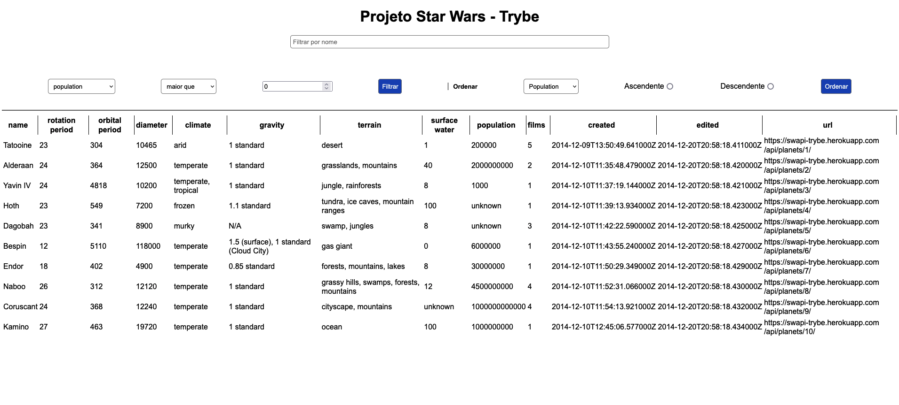

### Sobre o Projeto
Esse projeto tinha como objetivo criar uma lista com filtros dos planetas do universo de Star Wars, utilizando o React, Context API, React Hooks e a API Star Wars Planets.

---

#### Habilidades colocadas em prática.
  - Utilizar a _Context API_ do **React** para gerenciar estado.
  - Utilizar o _React Hook useState_;
  - Utilizar o _React Hook useContext_;
  - Utilizar o _React Hook useEffect_;
  - Criar _React Hooks_ customizados.

#### Preview

---
#### Para roda-lo localmente:
Clone o repositório e depois rode os seguintes comandos:

  - `npm install`

  - `npm start`